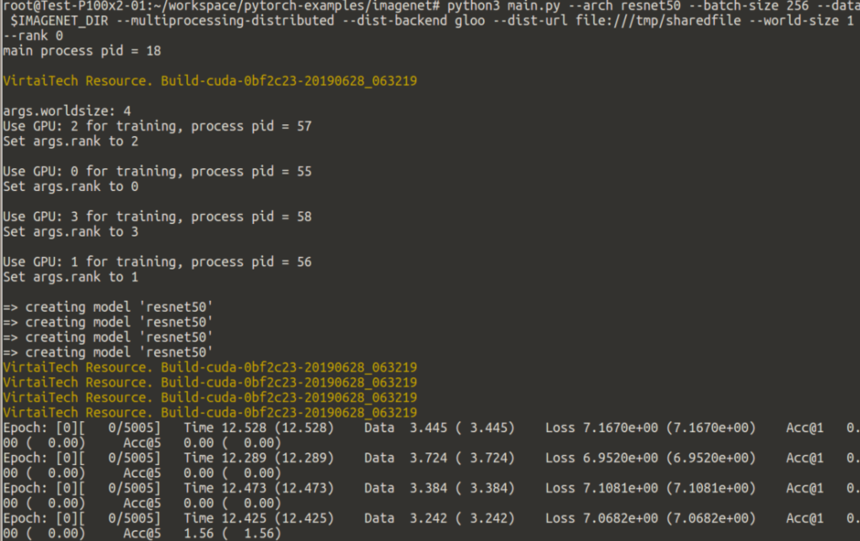

# PyTorch 使用Orion vGPU

我们假定用户在阅读本文之前，已经阅读过Quick Start部分的 [Docker容器章节](../doc/quick-start/container.md)，对于在容器环境中使用Orion vGPU软件有基本的了解。

我们推荐用户在我们准备的Orion Client容器内部运行PyTorch模型：

```bash
docker run -it --ipc host virtaitech/orion-client:cu10.0-torch1.3.0-py3 bash
```

这里的 `--ipc host` 对于使用共享内存加速是必需的。


## 支持情况
* 我们支持PyTorch 1.0 - 1.3 版本。

* 社区版目前不支持 PyTorch 通过 RDMA网络使用远程GPU资源

## [PyTorch官方模型例子](https://github.com/pytorch/examples)

本节中，我们介绍Orion vGPU对官方模型例子的支持情况。

我们在提供的各版本 PyTorch 镜像中均已将官方模型例子放在 `/root/examples` 目录下，用户可以进入其中每个模型子目录运行模型。

* [DCGAN](https://github.com/pytorch/examples/tree/master/dcgan)
  
    GitHub上页面建议使用的 lsun bedroom 数据集有42GB，下载较慢。因此，用户可以选择 [Celeb-A Faces dataset](http://mmlab.ie.cuhk.edu.hk/projects/CelebA.html)，下载其中的`img_align_celeba.zip`。下载后，用户应创建目录`celeba`，然后将压缩包解压到该目录，解压后目录结构为

    ```bash
    path/to/celeba
        -> img_align_celeba
            -> 000001.jpg
            -> 000002.jpg
                ...
    ```

    用户可以用 `--dataset lfw --dataroot=path/to/celeba` 参数使用解压后的数据集进行训练。用户可以用 `--ngpu` 参数指定训练所使用 Orion vGPU 的数目：
    ```bash
    python3 main.py --dataset lfw --dataroot /path/to/celeba --cuda --ngpu 1
    ```

    当 `--ngpu` 参数大于1时，PyTorch 将使用 [NCCL](https://developer.nvidia.com/nccl) 进行多卡训练。为此，运行 Orion Server 的宿主机上需要安装 NCCL，并在 `/etc/orion/server.conf` 中设置：

    ```bash
    [server-nccl]
        comm_id = "127.0.0.1:9970"
    ```

* [Neural Stype Transfer](https://github.com/pytorch/examples/tree/master/fast_neural_style) 支持

    用户应当用 `--cuda 1` 参数指定使用Orion vGPU训练模型。否则，模型会用CPU训练。

* [Imagenet](https://github.com/pytorch/examples/tree/master/imagenet) 支持使用 NCCL/GLOO 后端进行多Orion vGPU上的模型训练
    
    如果用户只想用单Orion vGPU进行训练，应当在运行 `main.py` 时明确指定：
    ```bash
    python3 main.py --arch resnet50 --batch-size 128 --gpu 0 $IMAGENET_DIR
    ```

    当用户设置`ORION_VGPU`值大于1时，PyTorch默认使用 [NCCL](https://developer.nvidia.com/nccl) 作为多卡训练的后端。
    
    为此，运行 Orion Server 的宿主机上需要安装 NCCL，并在 `/etc/orion/server.conf` 中加上：

    ```bash
    [server-nccl]
        comm_id = "127.0.0.1:9970"
    ```

    以使用2块 Orion vGPU 为例：

    ```bash
    python3 main.py --arch resnet50 \
        --batch-size 256 \
        --multiprocessing-distributed \
        --dist-backend nccl \
        --dist-url file:///tmp/sharedfile \
        --world-size 1 \
        --rank 0 \
        $IMAGENET_DIR
    ```

    上述命令中，
    * `--world-size 1 --rank 0`表示在每个Orion vGPU上都会启动一个向Orion vGPU发送CUDA API请求的工作进程
    * `--batch-size 256` 是两块Orion vGPU上的总batch_size，因此单卡的batch_size为128

    除了使用 NCCL 作为训练后端，用户也可以选择使用 GLOO 作为后端。这种情况下，用户只要通过 `--dist-backend gloo` 进行指定即可。

* [MNIST Convnets](https://github.com/pytorch/examples/tree/master/mnist) 支持

    ```bash
    python3 main.py
    ```

    默认会训练10个epochs。

* [MNIST Hogwild](https://github.com/pytorch/examples/tree/master/mnist_hogwild) 暂不支持，对CUDA IPC的全面支持还在开发阶段。

* [Linear Regression](https://github.com/pytorch/examples/tree/master/regression) 支持

    ```bash
    python3 main.py
    ```

* [Reinforcement Learning](https://github.com/pytorch/examples/tree/master/reinforcement_learning) 支持

    ```bash
    pip3 install -r requirements.txt
    # For REINFORCE:
    python3 reinforce.py
    # For actor critic:
    python3 actor_critic.py
    ```

* [SNLI with GloVe vectors and LSTMs](https://github.com/pytorch/examples/tree/master/snli) 支持

    用户需要安装torchtext和spacy，并下载spacy模型：
    此外，用户需要安装`spacy`，
    ```bash
    pip3 install torchtext spacy

    python3 -m spacy download en
    ```

    然后运行模型：

    ```bash
    python3 main.py
    ```

* [Super Resolution](https://github.com/pytorch/examples/tree/master/super_resolution)

    ```bash
    # Train 100 epochs
    python3 main.py --upscale_factor 3 --batchSize 4 --testBatchSize 100 --nEpochs 100 --lr 0.001 --cuda

    # Super Resolution
    python3 super_resolve.py --input_image dataset/BSDS300/images/test/16077.jpg --model model_epoch_500.pth --output_filename out.png
    ```

    生成的图片为 `out.png`，用户可以与输入图片 `dataset/BSDS300/images/test/16077.jpg` 对比效果。

* [Time Sequence Prediction](https://github.com/pytorch/examples/tree/master/time_sequence_prediction) 支持

    ```bash
    # Generate input data
    python3 generate_sine_wave.py
    # Train
    python3 train.py
    ```

    训练结束后会在当前目录生成预测的波形图。

* [Variational Auto-Encoders](https://github.com/pytorch/examples/tree/master/vae) 支持

    ```bash
    python3 main.py
    ```

* [Word Language Model using LSTM](https://github.com/pytorch/examples/tree/master/word_language_model) 支持

    ```bash
    # Train a tied LSTM on Wikitext-2 with CUDA
    python3 main.py --cuda --epochs 6 --tied
    # Generate samples from the trained LSTM model.
    python3 generate.py
    ```

## 多卡训练Resnet50模型示例

本节中，我们展示一个有趣的场景：将两块本地Tesla P100 16GB计算卡虚拟化成4块Orion vGPU用于在Imagenet数据集上训练Resnet50模型。我们在Orion Client内的资源申请环境变量为`ORION_VGPU=4`，`ORION_GMEM=7800`，这样可以保证每两块Orion vGPU位于一块Tesla P100计算卡上。

注：从性能的角度，应该将ORION_GMEM设置为较大值，例如`ORION_GMEM=15500`，相当于独占一张Tesla P100物理卡。这里我们将一块物理卡分为两块Orion vGPU，目前是为了展示和证明Orion vGPU软件的特性。

我们假定Orion Controller和Orion Server处于正常运行状态，容器以 `--ipc host` 模式启动，防火墙设置允许容器访问9123, 9960, 9961 端口。

我们的Imagenet原始数据放在 `/data/ImageNet_ILSVRC2012` 里，挂载到容器内部（根据[模型要求](https://github.com/pytorch/examples/tree/master/imagenet)，用户需要先将Imagenet validation目录下的图片移到1000个子目录）。

```bash
IMAGENET_DIR=/data/ImageNet_ILSVRC2012
docker run -it --rm \
    --ipc host \
    --net host \
    -v $IMAGENET_DIR:/root/imagenet_dir \
    -e ORION_CONTROLLER=127.0.0.1:9123 \
    -e ORION_VGPU=4 \
    -e ORION_GMEM=7800 \
    virtaitech/orion-client:cu9.0-torch1.1.0-py3
```

根据上一节所述，运行 Orion Server 的宿主机上需要安装 [NCCL](https://developer.nvidia.com/nccl)，并在配置文件  `/etc/orion/server.conf` 中加上：

```bash
[server-nccl]
    comm_id = "127.0.0.1:9970"
```

```bash
# (git clone pytorch models repo)
git clone https://github.com/pytorch/examples.git
cd examples/imagenet

# (train with GLOO backend)
python3 main.py --arch resnet50 \
    --batch-size 256 \
    --multiprocessing-distributed \
    --dist-backend nccl \
    --dist-url file:///tmp/sharedfile \
    --world-size 1 \
    --rank 0 \
    /root/imagenet_dir
```

上述命令中，多卡上的总 batch_size 为256，每块 Orion vGPU 上的 batch_size 为64。PyTorch识别出4块Orion vGPU设备，每块Orion vGPU上启动一个工作进程。



我们可以新开一个terminal接入此容器，用`orion-smi`工具展示Orion vGPU使用情况（容器内是UTC时间）


可以看到，容器内使用了四块Orion vGPU，均来自127.0.0.1，`<pGPU, vGPU>`序号对分别为`<0, 1>, <0, 0>, <1, 0>, <1, 1>`。`orion-smi`工具输出的PID和PyTorch日志中显示的PID是一致的。

我们在物理机操作系统上运行NVIDIA的`nvidia-smi`工具监视实际物理GPU使用情况：


可以看到，实际的计算任务被Orion Server进程`oriond`完全接管。

经过7个epoch后，我们的训练达到49.362% top-1精度，75.680% top-5精度。