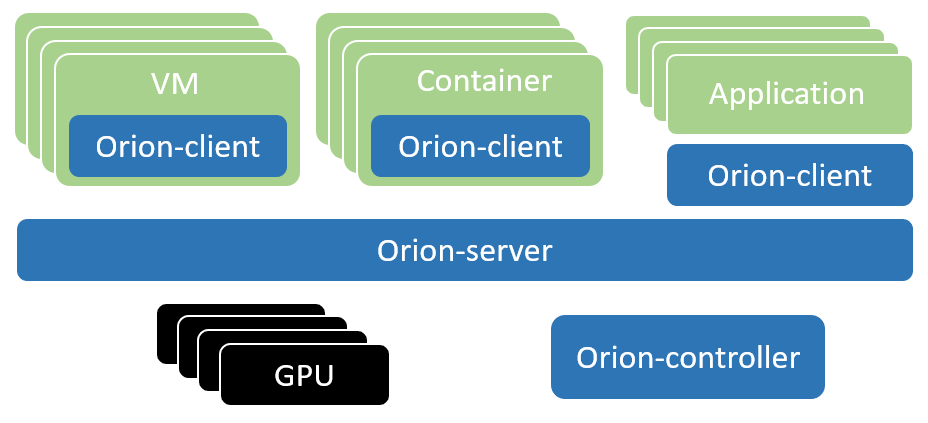

# Quick Start Overview
本文档主要包括如下部分：
* Orion  vGPU软件架构

* Orion  vGPU软件服务器端安装部署

* [场景一](container.md)：Docker 容器中使用本地节点GPU资源

* [场景二](kvm.md)：KVM 虚拟机中使用本地节点GPU资源

* [场景三](remote_rdma.md)：在没有GPU的节点上使用远程节点上的GPU资源

* 附录

本文档的目标是使读者能够快速在 1-2 台机器上部署 Orion vGPU 软件，并使用 Orion vGPU 进行深度学习加速。在三个典型场景中，我们展示在不同的环境下，如何运用Orion vGPU软件使用官方 TensorFlow 进行模型训练与推理。

更多主题，请参见我们的 [用户手册](../Orion-User-Guide.md) 以及 [技术博客](../../README.md#tech-blog)。

# Orion  vGPU软件架构



## Orion Client
该组件为一个运行时环境，模拟了NVidia CUDA的运行库环境，为CUDA程序提供了API接口兼容的全新实现。通过和Orion其他功能组件的配合，为CUDA应用程序虚拟化了一定数量的虚拟GPU（Orion vGPU）。  

使用CUDA动态链接库的CUDA应用程序可以通过操作系统环境设置，使得一个CUDA应用程序在运行时由操作系统负责链接到Orion Client提供的动态链接库上。由于Orion Client模拟了NVidia CUDA运行环境，因此CUDA应用程序可以透明无修改地直接运行在Orion vGPU之上。

## Orion Controller
该组件为一个长运行的服务程序，其负责整个GPU资源池的资源管理。其响应Orion Client的vGPU请求，并从GPU资源池中为Orion Client端的CUDA应用程序分配并返回Orion vGPU资源。  

该组件可以部署在数据中心任何网络可到达的系统当中。每个资源池部署一个该组件。资源池的大小取决于IT管理的需求，可以是整个数据中心的所有GPU作为一个资源池，也可以每个GPU服务器作为一个独立的资源池。

## Orion Server
该组件为一个长运行的系统服务，负责GPU资源化的后端服务。Orion Server部署在每一个物理GPU服务器上，接管本机内的所有物理GPU。Orion Server通过和Orion Controller的交互把本机的GPU加入到由Orion Controller管理维护的GPU资源池当中。 

当Orion Client端应用程序运行时，通过Orion Controller的资源调度，建立和Orion Server的连接。Orion Server为其应用程序的所有CUDA调用提供一个隔离的运行环境以及真实GPU硬件算力。

# Orion  vGPU软件服务器端安装部署

读者需要确保Orion Controller，Orion Server和Orion Client都是最新版本。不同版本的Orion vGPU组件无法共同工作。

我们假定读者已经将 [GitHub repo](https://github.com/virtaitech/orion) 克隆到了本地：

```bash
git clone https://github.com/virtaitech/orion

cd orion
```

## <a id="controller"></a> 步骤一：部署 Orion Controller

### 启动 Orion Controller

在集群上部署 Orion vGPU 软件时，Orion Controller 可以运行在任意节点上。本文为方便起见，将 Orion Controller 和 Orion Server 服务部署在同一台含有GPU的节点上。

下述命令将在后台启动 Orion Controller，使用 `controller.yaml` 中的配置：

```bash
cd orion-controller

nohup ./orion-controller start --config-file controller.yaml &
```

默认下日志输出到当前目录的 `log` 文件。查看日志内容：

```bash
cat log
```

正常情况下会输出如下的日志 （去掉了时间戳），表明 Orion Controller 正常工作，并监听来自网络所有地址对 Orion vGPU 的资源请求。

```bash
level=info msg="Etcd Server is ready!"
level=info msg="Creating database connection to http://
level=info msg="Database connection is created."
level=info msg="Orion CE Controller is launching, listening on 0.0.0.0:9123"
```

## <a id="server"></a> 步骤二：安装部署 Orion Server 服务

### 安装环境准备
依赖项
* Ubuntu 14.04 LTS 或更高版本 / CentOS 7.x
* CUDA 9.0 / 9.1 / 9.2 / 10.0 / 10.1
* CUDNN 7.4.2 及以上版本，推荐 7.6.x
* NVIDIA driver 需要满足对应 CUDA SDK 的 [最低要求](https://docs.nvidia.com/deploy/cuda-compatibility/index.html#binary-compatibility__table-toolkit-driver)
* libcurl, libibverbs
  
用户可参考附录中的 [CUDA和CUDNN快速安装](appendix.md#install-cuda) 小节来安装 `CUDA 10.0` 和`CUDNN 7.6.2`。下文中我们假设用户的CUDA安装路径为默认的 `/usr/local/cuda-10.0`，而CUDNN的动态库放在 `/usr/local/cuda-10.0/lib64`目录下。

Orion Server所依赖的 `libcurl` 以及 `libibverbs` 库：可以通过以下命令安装

```bash
# Ubuntu 16.04
sudo apt install -y libcurl4-openssl-dev libibverbs1

# CentOS 7.x
sudo yum install -y libcurl-devel.x86_64 libibverbs-devel
```

### 安装Orion Server

由于Orion Server运行时需要有CUDA环境支持，所以用户需要确保 `/usr/local/` 路径下有所需要支持的CUDA版本。例如，如果Orion Client端需要使用CUDA 10.0的应用，那么Orion Server所在物理机上，CUDA SDK需要安装到 `/usr/local/cuda-10.0` 路径（默认安装路径）。

若要支持多版本CUDA，请将所有的CUDA SDK都放在`/usr/local`下。

在宿主机上运行如下命令安装 Orion Server

```bash
cd orion-server

sudo ./install-server.sh 
```

若安装成功，会有下列输出：

```bash
orion.conf.template is copied to /etc/orion/server.conf as Orion Server configuration file.
Orion Server is successfully installed to /usr/bin
Orion Server is registered as system service.
Using following commands to interact with Orion Server :

        systemctl start oriond      # start oriond daemon
        systemctl status oriond     # print oriond daemon status and screen output
        systemctl stop oriond       # stop oriond daemon
        journalctl -u oriond        # print oriond stdout

Before launching Orion Server, please change settings in /etc/orion/server.conf according to your environment.
```

上述命令会将 Orion Server 注册为由 `systemctl` 管理的系统服务 `oriond`。

### <a id="server-config"></a> Orion Server 服务配置

Orion  vGPU 软件支持以下的 Orion Client Runtime 与 Orion Server 之间数据交互的通信模式

* 本地共享内存（SHM）
* 本地/远程 RDMA
* 本地/远程 TCP

Orion Server服务启动时，读取`/etc/orion/server.conf` 配置文件来决定启动模式。
  
本文后面的各小节会结合不同场景 （容器、KVM虚拟机，或者没有GPU的本地计算节点），解释应当如何根据使用环境和需求合理配置 `/etc/orion/server.conf`。

### 启动Orion Server服务

我们保留 `/etc/orion/server.conf` 中的默认配置，用下述命令启动 Orion Server 服务：

```bash
sudo systemctl start oriond
```

Orion Server 的主日志路径为 `/var/log/orion/server.log`，我们查看此日志：

```bash
cat /var/log/orion/server.log
```

正常情况下，日志如下（去掉时间戳）：

```bash
[INFO] Connecting to Orion Controller 127.0.0.1:9123
[INFO] Successfully connect to Orion Controller.
[INFO] Report Orion compatible resource to 127.0.0.1:9123
[INFO] GeForce RTX 2080 Ti (ID: GPU-36945fda-df5a-5fdc-b0c2-40aa432bd032) is reported to Orion Controller.
[INFO] Orion Server listens on 127.0.0.1:9960
```

这表明 Orion Server 首先扫描了物理机上的 GPU 信息并成功向 Orion Controller 汇报资源，随后监听在 `127.0.0.1:9960`。

# 典型使用场景

下面，我们选取三个典型场景，展示在不同的环境下，如何运用Orion vGPU软件**无修改**地使用官方 TensorFlow 1.12 进行模型训练与推理。

具体地，我们将展示以下例子：

## [Docker容器中使用本地节点GPU资源](container.md)

* 本例中，我们在容器内使用一块Orion vGPU，该vGPU位于本地物理机上的一块 NVIDIA RTX 2080Ti 显卡。

* 容器用 `docker run` 命令启动，不需要将物理机上的GPU设备直通穿透（passthrough）到在容器内部。通过安装Orion vGPU软件，容器得以使用Orion vGPU资源加速计算。

* 安装部署完成后，我们会在容器中运行 CUDA 10.0 SDK Samples，以及 [TensorFlow 2.0 Pix2Pix 教程](https://www.tensorflow.org/tutorials/generative/pix2pix)。

## [KVM虚拟机中使用本地节点GPU资源](kvm.md)
  
* 在 KVM 虚拟机中，在Orion vGPU软件的共享内存（shared memory, SHM）模式下进行 CIFAR10 数据集上的 CNN 模型训练与推理。本例中，我们在虚拟机内使用两块Orion vGPU, 两块vGPU分别位于本地物理机上的两块 NVIDIA Tesla V100 计算卡。
* 安装部署完成后，我们在KVM虚拟中运行TensorFlow官方模型repo中的CIFAR10_Estimator https://github.com/tensorflow/models/tree/master/tutorials/image/cifar10_estimator


## [通过RDMA使用远程节点GPU资源](remote_rdma.md)
  
* 在 没有 GPU 的节点上，在Orion vGPU软件的 RDMA 模式下使用远程节点GPU资源进行 Imagenet 数据集上的 CNN 模型训练与推理。本例中，我们在虚拟机内使用两块Orion vGPU, 分别位于**远程节点**上的两块 NVIDIA Tesla V100 计算卡。
* 安装部署完成后，我们运行TensorFlow official benchmark进行Imagnet上CNN模型训练 https://github.com/tensorflow/benchmarks/tree/master/scripts/tf_cnn_benchmarks 
* 我们先展示使用随机生成的Imagenet数据 (synthetic Imagenet data) 进行`inception3`模型训练。通过Orion vGPU软件，我们使用远程节点上的两块Tesla V100训练500个batch。
* 我们展示使用TFRecord格式的真实Imagenet数据训练`inception3`模型。通过Orion vGPU软件，我们使用远程节点上的两块Tesla V100训练5个完整epoch，最终在验证集上达到36.92%的top-1精度，64.04%的top-5精度。


## 更多使用场景

读者可以在我们的主页上 [技术博客](../../README.md#tech-blog) 栏下找到更多的主题

# [附录](appendix.md)

我们介绍了以下内容

* 快速安装CUDA和cuDNN环境

* 配置防火墙