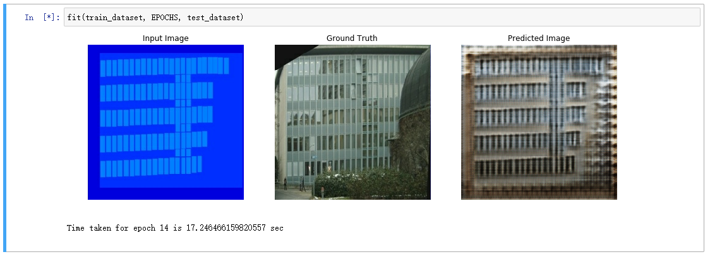
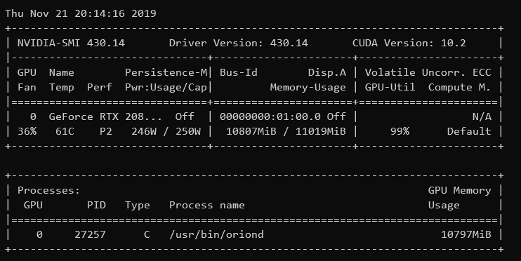

# <a id="scenario-1"></a> 场景一：Docker 容器中使用本地节点GPU资源

本章中我们用到的节点配置如下：

* Intel(R) Core(TM) i7-9700K CPU @ 3.60GHz (8 cores)
* NVIDIA RTX 2080 Ti, 11 GB
* Ubuntu 16.04 LTS
* Docker CE 18.09.3
* CUDA 10.0
* CUDNN 7.6.2

<div align=center>


</div>

完成 Orion vGPU 软件部署后，我们将在普通的Docker容器中运行下面的例子：

- 运行 CUDA 10.0 SDK Samples

- 启动 Juypter Notebook 运行 [TensorFlow 2.0 Pix2Pix 教程](https://www.tensorflow.org/tutorials/generative/pix2pix)

进入后续步骤之前，我们假设：
* Orion Server 已经根据 [Orion Server安装部署](README.md#server)小节成功部署
* Orion Controller 已经根据 [Orion Controller安装部署](README.md#controller)小节部署

## **Orion Server 配置与启动**
正如 [Orion Server服务配置](README.md#server-config) 中所介绍的，我们需要配置 `/etc/orion/server.conf` 文件中的两类属性：

* Orion Server 与 Orion Client通信的数据通路，即 `bind_addr`
* Orion Server 数据通路模式 （SHM / RDMA / TCP）
  
### Orion Server 数据通路地址设置

`bind_addr` 指 Orion Server 与 Orion Client通信的数据通路，Orion Client 必须能通过网络访问这一地址。

对于本地容器环境来说，最简单的方法是以 `docker run --net host` 模式启动容器，使容器与宿主机共享网络环境。此时，`bind_addr`使用默认的`127.0.0.1`即可。

### Orion Server 数据通路模式设置

对于本地虚拟化环境，通过共享内存（SHM）加速数据传输能获得最高性能。为此，我们需要将 `enable_shm` 设置为 `true`，并将`enable_rdma`设为`false`。

### 启动Orion Server

根据上述讨论，我们保留安装 Orion Server 后 `/etc/orion/server.conf` 中的默认配置即可。

## **Orion Client容器启动**

我们提供配置好 Orion Client Runtime 的 TensorFlow 2.0 的 [Docker镜像](../../client-dockerfiles/client-cu10.0-tf2.0-py3)：

```bash
docker pull virtaitech/orion-client:cu10.0-tf2.0-py3
```

### Orion Client 端资源请求

对于Orion Client 端容器来说，向 Orion Controller 申请 Orion vGPU 资源时需要设置以下环境变量：

* `ORION_VGPU`：容器中每个进程申请的Orion vGPU数目。本例中我们设置 `ORION_VGPU=1`。

* `ORION_GMEM`：申请的每个Orion vGPU所能使用的显存数目（单位：MB）。由于我们使用一张 RTX 2080Ti显卡，显存上限为11G，我们设置 `ORION_GMEM=11000`。

### Orion Client 使用 SHM 加速数据传输

对于本地容器虚拟化环境，为了使用 SHM 加速数据传输，我们要求容器以 `--ipc host` 模式启动。

### 启动容器

```bash
docker run -it --rm \
    --ipc host \
    --net host \
    -e ORION_VGPU=1 \
    -e ORION_GMEM=11000 \
    virtaitech/orion-client:cu10.0-tf2.0-py3
```

在运行应用之前，我们可以在容器内用 `orion-check` 工具检查 Orion Client 容器是否能正常与 Orion Controller 通信：

```bash
# From inside Orion Client container
orion-check runtime client
```

正常情况下，输出应该是：

```bash
# (omit output)
Using Orion Controller configuration in /etc/orion/client.conf

Orion Controller addrress is set as 127.0.0.1:9123 in configuration file. Using this address to diagnose Orion Controller
Checking Orion Controller (127.0.0.1:9123) status ...
[Info] Orion Controller setting may be different in different SHELL.
[Info] Environment variable ORION_CONTROLLER has the first priority.

Orion Controller Version Infomation : api_version=0.2,data_version=0.2
There are 4 vGPU under managered by Orion Controller. 4 vGPU are free now.
```

## **运行 CUDA Samples**

容器里 `/root/cuda10.0-regression` 路径下有一组 NVIDIA CUDA SDK Samples，可供我们测试 Orion vGPU 软件。

### 基础例子

我们先运行最简单的 `vectorAdd` 例子：

```bash
# From inside container
cd cuda10.0-regression

cuda_samples/vectorAdd/vectorAdd
```

正常运行时，输出如下（去掉时间戳）：

```bash
[Vector addition of 50000 elements]
VirtaiTech Resource. Build-cuda-e0ac006-20191120_144346
[INFO] Using Orion resource (b243385d-a8d0-4676-919b-cabb1cd8cf68) 56c2db90-ca7e-45b1-80c2-4767ecc90ee5 : 127.0.0.1:9960/0/0
Copy input data from the host memory to the CUDA device
CUDA kernel launch with 196 blocks of 256 threads
Copy output data from the CUDA device to the host memory
Test PASSED
Done
[INFO] Releasing Orion resource ...
```

日志中黄色的行 `[INFO] Using Orion resource` 表明应用程序成功向 Orion Controller 申请到了 Orion vGPU 资源。

### **确认 Orion vGPU 工作在 SHM 加速模式下**

如果用户设置不正确，例如 Orion Server 配置中 `enable_shm = false`，或者容器没有以 `--ipc host` 模式启动，Orion vGPU 会自动退化到 TCP 模式下，此时对于大型任务，性能会有一定损失。因此，我们建议用户通过 Orion Server 日志文件 `/var/log/orion/server.log` 确认当前数据通路工作模式的确是 SHM。

```bash
cat /var/log/orion/server.log
```

可以看到新增的日志内容：

```bash
[INFO] Creating session 0
[INFO] Get resource list (group_id:b7d66ba3-8aff-4961-ab78-4d00887b4cb4) for allocation ID 2dca8c7a-4eb8-4707-ae52-9cb62f0794d1 : nvidia_cuda;127.0.0.1,9960,GPU-36945fda-df5a-5fdc-b0c2-40aa432bd032,0,0,25,11000
[INFO] Using SHM 1091534882 for acceleration.
[INFO] Session 0 exits.
```

这里的 `Using SHM <shm-id> for acceleration.` 表明 Orion vGPU 工作在 SHM 模式下。

### 全体 CUDA SDK Samples 测试

`/root/cuda10.0-regression/cuda_samples` 下共有 77 个 CUDA SDK Sample，能够全面测试 Orion vGPU 对 CUDA 的支持。这些 CUDA Samples 以 `nvcc -cudart=shared args...` 模式编译，因此可以动态链接到 Orion Client Runtime。

我们提供了脚本以便用户运行所有例子进行回归测试：

```bash
cd /root/cuda10.0-regression

./run.sh
```

## **运行 Jupyter Notebook**

```bash
# From inside Orion Client container
cd /root

jupyter notebook --ip=0.0.0.0 --no-browser --allow-root
```

会看到类似于下面的输出：

```bash
# Omit output

    To access the notebook, open this file in a browser:
        file:///root/.local/share/jupyter/runtime/nbserver-38-open.html
    Or copy and paste one of these URLs:
        http://lab-0:8888/?token=4507dbe5c542dd570370c2425f14f83f06793da178978558
     or http://127.0.0.1:8888/?token=4507dbe5c542dd570370c2425f14f83f06793da178978558
```

如果用户可以使用这台机器的图形界面，那么可以打开浏览器，输入所提示地址 `127.0.0.1:8888/?token=<token>`。

否则，用户可以在安装了浏览器的节点（例如笔记本电脑）上进行 SSH 端口转发：

```bash
# On laptop
ssh -Nf -L 8888:localhost:8888 <username@client-machine>
```

然后在本地浏览器里面输入 `127.0.0.1:8888/?token=<token>` 地址（将`<token>`替换成 Jupyter Notebook 所输出的实际 token）访问 Jupyter Notebook。


## **使用 TensorFlow 2.0 进行 pix2pix 模型训练与推理**

在页面中，打开 `pix2pix/pix2pix.ipynb`，页面的第一部分是对模型的简要介绍。

从 "Import TensorFlow and other libraries" cell 开始，用户可以通过依次点击菜单栏下方的 **Run** 按钮，执行每一个Cell。

对于第一次接触 Jupyter Notebook 的用户来说，可能需要注意：

* 每次点击 **Run** 按钮只会运行当前选中的 cell。对于 Python 程序来说，用户需要手动运行每个 Cell 才能顺序执行下去；

* 点击 **Run** 按钮后，cell 左侧如果显示星号 [*] 表示正在执行中，只有当星号变成数字序号时才执行完成。

一步步执行下来，用户会最终开始训练过程：



训练的过程中，我们可以在宿主机上通过 `nvidia-smi` 工作监视物理 GPU 的使用情况：



从图中可以看到，真正使用物理GPU的进程是 Orion Server 的服务进程 `/usr/bin/oriond`，而不是容器中正在执行 TensorFlow 任务的 Python 进程。这表明容器中的应用程序使用的是 Orion vGPU 资源，对物理GPU 的访问完全由 Orion Server 所接管。

训练完 150 个 epochs 以后，可以在测试集上运行模型。